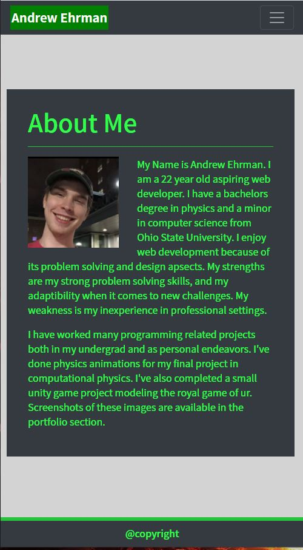
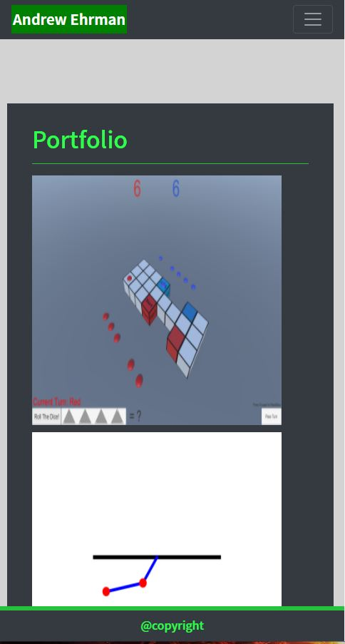
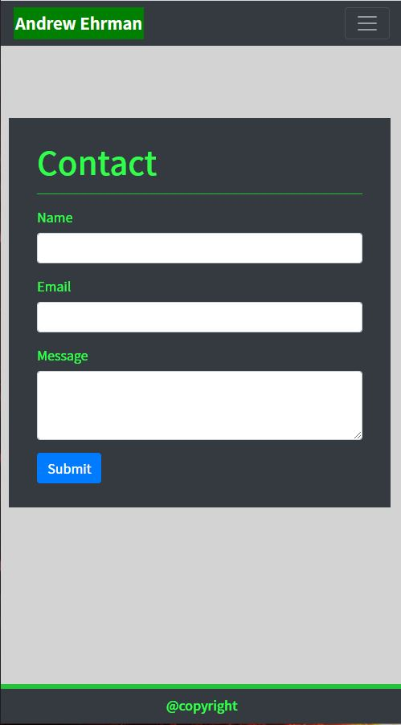

# ResponsivePortfolio

## Table of Contents
[Description](#description)

[Installation](#installation)

[Usage](#usage)

[Credits](#credits)

## Description
This github contains a portfolio framework. This portfolio uses bootstrap components in order to make a responsive page. The navbar navigates to 3 different htmls. Contact, Portfolio, and about me. Contact contains a non implemented form sheet. Portfolio contains pictures and gifs of past projects I have worked on. The following screen shots are at small screen size.

### About me (main)

### Portfolio

### Contact

## Installation
Downloading contains all Assets.

## Usage
The page can be viewed at https://breakfastitem.github.io/ResponsivePortfolio/. It can also be viewed by opening index.html with a browser.

## Credits
Made By Andrew Ehrman.

### Components Used
Bootstrap components

jquery.js

popper.js
